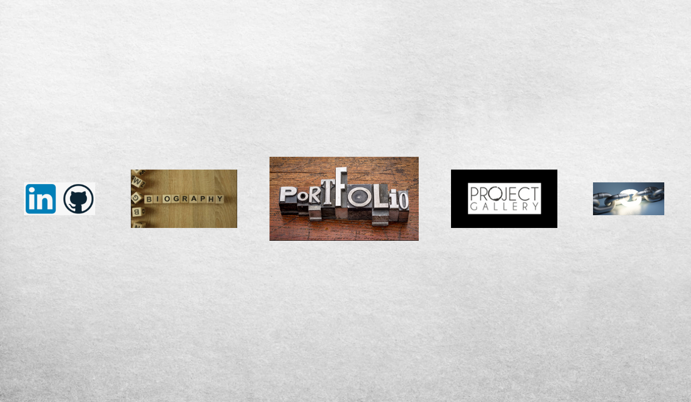

# Portfolio

## Approach

I used a large project approach when building this site, following the normal stages and processes involved when planning for and executing an enterprise application.  The steps are outlined as follows:

1. Write up user stories to explore use cases and help define requirements
2. Based on user stories, create MVP and stretch goals
    1. Sort stretch goals into Bronze, Silver, and Gold
3. Create wireframes of all screens/pages on the site for design reference
3. Write pseudocode based on project goals
4. First round of implementation
    1. Review changes and confirm that they are in line with project goals
    2. Second round of implementation (and so on)

## Technologies Used

- HTML
- CSS
- JavaScript
- Git and GitHub

## Still to Do

Although I was able to create a good working base, there is much that I would still like to do on my site.  Below is a roadmap of what I want to accomplish in the future.

- Update the font to something more fun
- Play with the CSS to make it cleaner
- Fine tune some of the JS interactions and add more of them
- Spend some time sourcing images for buttons and backgrounds that are more thematic and personalized
- Add another page with details about my current activities and projects in development

## About Me

I am an aspiring software engineer currently enrolled in the Software Engineering Immersive course offered by General Assembly.  I have had a lifelong passion for computers and computer science, and have loved coding from the moment I started learning about it.  While life has had it's twists and turns, I am excited to finally be pursuing my dream of becoming a software engineer and doing what I love every day.  Thank you for visiting my site!

If you want to contact me, please feel free to reach out via [email](mailto:andrewretherford@gmail.com).  You can also check out my [GitHub](https://github.com/andrewretherford) and [LinkedIn](https://www.linkedin.com/in/andrew-retherford) pages.
