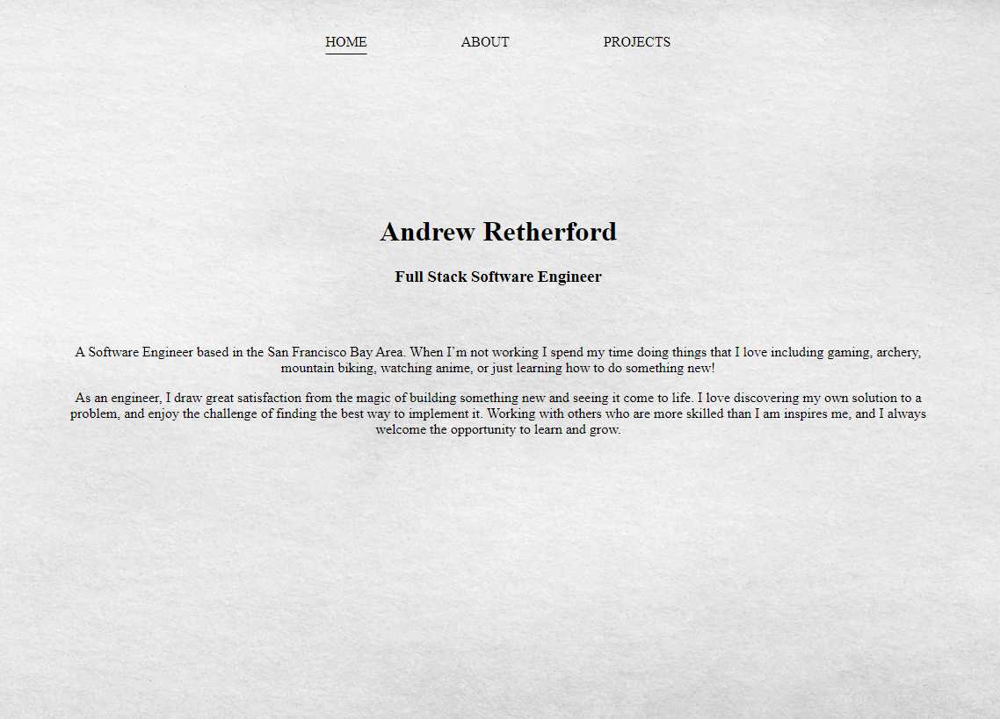
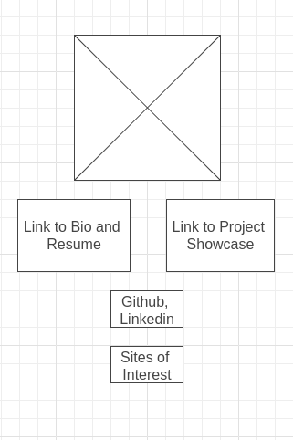
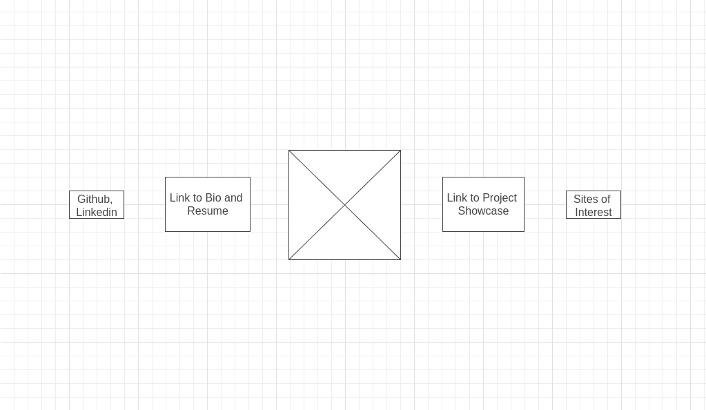
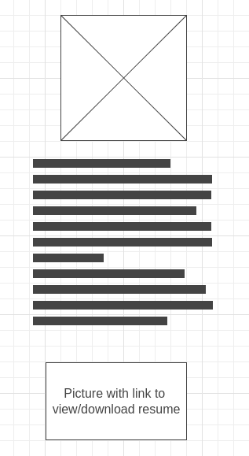
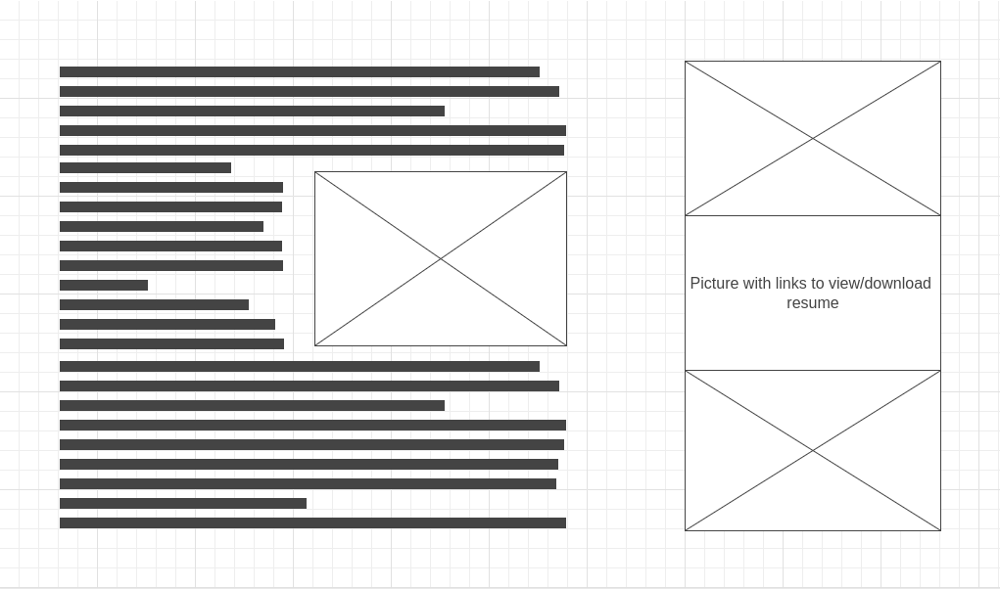
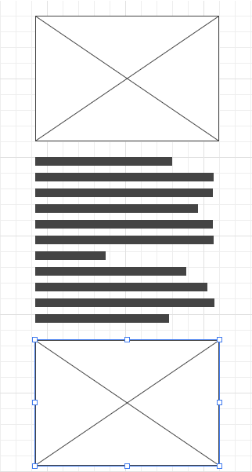
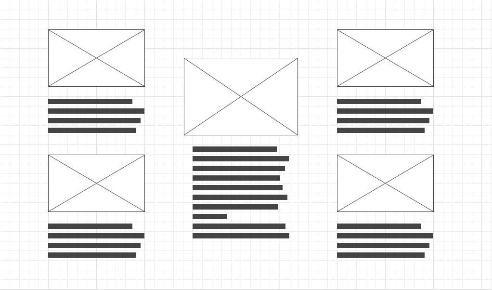

<h1 align="center">
    <a href="https://andrewretherford.github.io/portfolio/">
        Portfolio
    </a>
</h1>

 

# Approach

This site started as a class project meant to challenge us to build a page without using modern platforms and styling packages such as React JS and Bootstrap.  I took this to heart as a chance to improve my skills with HTML, CSS, and JavaScript. Despite some frustration, I really enjoyed the challenge and the payoff in understanding that I got from overcoming some of the basic problems that are normally solved for us by modern tools (I'm lookin' at you project carousel).

I used a large project approach when building this site, following the normal stages and processes involved when planning and executing an enterprise application.  

- Creating user stories to develope use cases
- Building MVP and stretch goals
- Drawing up wireframes based on initial vision
- Writing pseudocode for the various pages and components

## Technologies Used

# Planning

## User Stories

 - As an employer, I want to easily find details about work history and experience, as well as personal outlook and brand in order to make an initial decision about interviewing a candidate without spending too much time
 - As a product owner I want to be able to get a feel for style and competence based on page architecture and design
 - As a friend I want to see cool stuff that my friend has built and have something that I can reference to network contacts
 - As a member of a generation not familiar or comfortable with navigating the internet, I want the interface to be simple and intuitive so that I can enjoy the content without becoming frustrated

 ## Wireframes

<h3 align="center" >Home page for mobile and tablet (this design was later discarded in favor of a cleaner layout)</h3>

    

<h3 align="center" >Home page for desktop (this design was later discarded in favor of a cleaner layout)</h3>

    

<h3 align="center" >Bio and resume for mobile and tablet (later updated to 'About' and reworked)</h3>

    

<h3 align="center" >Bio and resume for desktop (later updated to 'About' and reworked)</h3>

    

<h3 align="center" >Project page for mobile and tablet</h3>

    

<h3 align="center" >Project page for desktop</h3>

    

## Still to Do

After I finished my course at General Assembly, I was able to complete many of the goals that I had for this site, including a second pass at design/layout, as well as the list below.  Given that this is a portfolio, I'm sure I'll be tooling around with it for the foreseeable future, but as it stands I feel comfortable calling the site finished. 

~~- Play with the CSS on the project page to make it more attractive~~
~~- Fine tune some of the JS interactions and add more of them~~
~~- Spend some time sourcing images for buttons and backgrounds that are more thematic and personalized~~
~~- Add another page with details about my current activities and projects in development~~
- Play with formatting of the project distribution chart on mobile to make it less squished
- Adjust arrow width at all breakpoints so that they don't overlap modal content where avoidable

### Link to Live Page

Please check out my live [portfolio](https://andrewretherford.github.io/portfolio/)

## About Me

I am a full stack software engineer with a lifelong passion for computers and computer science. I have loved coding from the moment I took my first C++ class, and I hope to be doing this for the rest of my life.  When I'm not coding on my ultrawide monitor, I enjoy mountain biking, working out, archery, and gaming.  As a typical nerd I love anime and fantasy/science fiction books, and while I'm not in a group currently, I enjoy D&D and other table top games.

Thank you for visiting my site! If you want to contact me, please feel free to reach out via [LinkedIn](https://www.linkedin.com/in/andrew-retherford).
